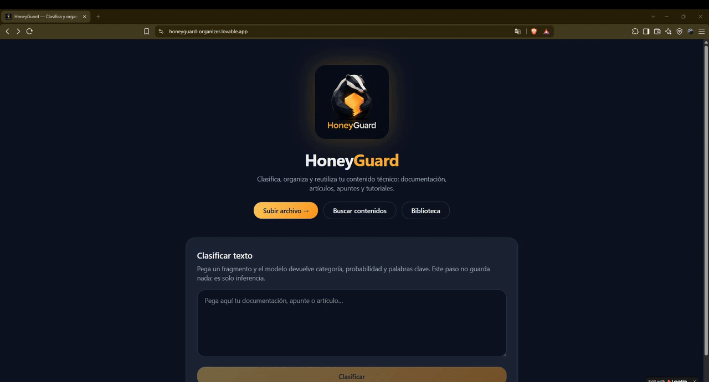
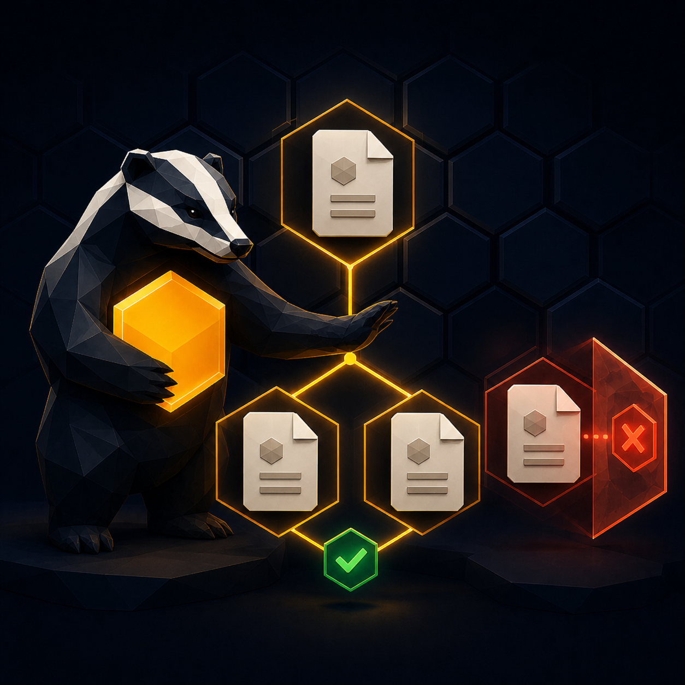
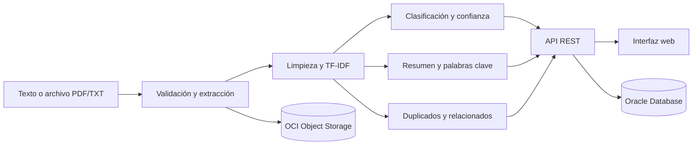

<div align="center">
  

  <p><strong>Organiza, clasifica y reutiliza conocimiento técnico con Machine Learning.</strong></p>
  <p>
    Proyecto desarrollado por <strong>Team 25 — tejONEs</strong> para el<br />
    <strong>Hackathon ONE G9 | Alura + Oracle</strong>.
  </p>
  <p>
    <a href="https://honeyguard-organizer.lovable.app">Ver demo 🍯</a> ·
    <a href="https://g9-latam-team-25.onrender.com/docs">Explorar API 🦡</a> ·
    <a href="https://github.com/No-Country-simulation/G9-LATAM-Team-25/issues">Reportar un problema 🪲</a>
  </p>
</div>

<p align="center">
  
  
  
  
  
</p>


## El problema

La documentación técnica suele quedar dispersa entre archivos, artículos, tutoriales y apuntes. Con el tiempo aparecen duplicados, títulos poco descriptivos y contenidos difíciles de encontrar o reutilizar.

## La solución

**HoneyGuard** transforma documentos técnicos en conocimiento organizado. La plataforma recibe texto o archivos PDF/TXT, extrae su contenido y aplica Procesamiento de Lenguaje Natural para clasificarlos, resumirlos, generar palabras clave y relacionarlos con otros recursos.

La solución reúne una interfaz web, una API REST, un pipeline de Machine Learning y servicios de Oracle Cloud para ofrecer un flujo completo: desde la carga de un documento hasta su consulta posterior.

## Demostración

<div align="center">
  
  <br />
  <sub>Carga, clasificación, metadatos persistidos y consulta del documento almacenado.</sub>
</div>

## Funcionalidades

<table>
  <tr>
    <td width="55%" valign="middle">
      <h3>📄 Carga y análisis de documentos</h3>
      <p>
        HoneyGuard recibe documentación técnica y transforma el contenido del archivo
        en información lista para consultar y reutilizar.
      </p>
      <ul>
        <li>Admite archivos <code>.pdf</code> y <code>.txt</code>.</li>
        <li>Extrae y normaliza el texto digital.</li>
        <li>Conserva el archivo original en OCI Object Storage.</li>
        <li>Registra el contenido y sus metadatos en Oracle Database.</li>
      </ul>
    </td>
    <td width="45%" align="center" valign="middle">
      
    </td>
  </tr>
  <tr>
    <td width="45%" align="center" valign="middle">
      
    </td>
    <td width="55%" valign="middle">
      <h3>🏷️ Clasificación automática</h3>
      <p>
        El modelo analiza el texto mediante TF-IDF y Regresión Logística para
        asignar una categoría técnica de forma automática.
      </p>
      <ul>
        <li>Devuelve la categoría y su nivel de confianza.</li>
        <li>Genera palabras clave representativas.</li>
        <li>Indica cuándo el resultado requiere revisión.</li>
        <li>Cubre siete áreas del conocimiento tecnológico.</li>
      </ul>
    </td>
  </tr>
  <tr>
    <td width="55%" valign="middle">
      <h3>📝 Resumen automático</h3>
      <p>
        El resumidor extractivo identifica los fragmentos más relevantes sin
        inventar información ni alterar el sentido del documento.
      </p>
      <ul>
        <li>Selecciona hasta tres fragmentos representativos.</li>
        <li>Conserva el orden en el que aparecen en la fuente.</li>
        <li>Reduce redundancias mediante Maximal Marginal Relevance.</li>
        <li>Procesa texto técnico, listas, HTML visible y fragmentos de código.</li>
      </ul>
    </td>
    <td width="45%" align="center" valign="middle">
      
    </td>
  </tr>
  <tr>
    <td width="45%" align="center" valign="middle">
      
    </td>
    <td width="55%" valign="middle">
      <h3>🔎 Búsqueda y contenidos relacionados</h3>
      <p>
        La plataforma compara los recursos mediante similitud coseno para ayudar
        a recuperar información y evitar contenido repetido.
      </p>
      <ul>
        <li>Detecta documentos duplicados y muestra su similitud.</li>
        <li>Recomienda recursos relacionados.</li>
        <li>Busca por texto dentro del contenido y sus metadatos.</li>
        <li>Filtra por categoría, autor y tipo de contenido.</li>
      </ul>
    </td>
  </tr>
</table>

## ¿Cómo funciona?



1. El usuario carga un PDF/TXT o envía texto directamente a la API.
2. HoneyGuard valida la entrada y extrae el contenido visible.
3. El pipeline limpia el texto y genera su representación TF-IDF.
4. El modelo determina la categoría, la confianza y las palabras clave.
5. El sistema genera un resumen y busca duplicados o documentos relacionados.
6. El archivo original se almacena en OCI Object Storage y sus datos en Oracle Database.
7. El contenido queda disponible para búsqueda, filtrado y consulta desde la aplicación.

### Categorías del modelo

- Backend
- Frontend
- Data Science
- Mobile
- DevOps
- Cloud
- Bases de Datos

El conjunto de datos de trabajo reúne **1.400 recursos técnicos**, con 200 registros por categoría, obtenidos de fuentes como Microsoft Learn, Stack Exchange, Coursera y OpenAlex.

## Integraciones

| Componente | Integración |
| --- | --- |
| Aplicación web | React, TypeScript, TanStack Start, Tailwind CSS y Lovable |
| API pública | FastAPI desplegada en Render |
| Machine Learning | scikit-learn, TF-IDF, Regresión Logística y Joblib |
| Procesamiento de texto | Python, pandas y NLTK |
| Base de datos | Oracle Autonomous Database mediante SQLAlchemy y `oracledb` |
| Almacenamiento | OCI Object Storage para los archivos originales |

## Documentos compatibles

- Archivos PDF con texto digital seleccionable.
- Archivos de texto plano `.txt`.
- Documentación, tutoriales, manuales, apuntes y artículos técnicos.
- Contenido en español para las categorías cubiertas por el modelo.

## API REST

La API pública está disponible en:

- Base URL: <https://g9-latam-team-25.onrender.com>
- Swagger UI: <https://g9-latam-team-25.onrender.com/docs>
- OpenAPI: <https://g9-latam-team-25.onrender.com/openapi.json>

### Endpoints principales

| Método | Endpoint | Descripción |
| --- | --- | --- |
| `POST` | `/contenido/clasificar` | Clasifica texto sin guardarlo en la base de datos |
| `POST` | `/contenido/archivo` | Procesa, clasifica y almacena un archivo |
| `GET` | `/contenido` | Lista documentos con paginación y filtros |
| `GET` | `/contenido/{documento_id}` | Recupera el detalle de un documento |
| `GET` | `/buscar` | Busca por texto y filtra por metadatos |
| `GET` | `/health` | Informa el estado del servicio |

### Clasificar texto

`POST /contenido/clasificar`

Ejemplo verificado contra el servicio publicado:

```json
{
  "texto": "React permite crear interfaces frontend mediante componentes, hooks, estado, propiedades y eventos. TypeScript añade tipado estático y Vite compila la aplicación web.",
  "top_n_palabras_clave": 5
}
```

```json
{
  "categoria": "Frontend",
  "probabilidad": 0.866268977539909,
  "palabras_clave": [
    "estático",
    "frontend",
    "react",
    "eventos",
    "interfaces"
  ],
  "requiere_revision": false
}
```

El indicador `requiere_revision` se activa cuando la confianza del modelo aconseja validar manualmente la categoría.

### Procesar un archivo
`POST /contenido/archivo`

Solicitud `multipart/form-data`:

| Campo | Tipo | Descripción |
| --- | --- | --- |
| `file` | Archivo | Documento `.pdf` o `.txt` |
| `autor` | Texto | Autor del recurso |
| `tipo` | Texto | Tipo de contenido, por ejemplo `tutorial`, `apunte` o `documentación` |

La respuesta agrupa los metadatos persistidos, la clasificación, el resumen, las palabras clave, el texto extraído y los contenidos relacionados. Si el archivo coincide con un recurso existente, la API devuelve el documento original y su nivel de similitud.

## Ejecutar el proyecto localmente

### Requisitos previos

- Git
- Python 3.10 o superior
- Node.js 20 o superior y npm
- Credenciales de Oracle Cloud para utilizar la persistencia

### 1. Clonar el repositorio

```bash
git clone https://github.com/No-Country-simulation/G9-LATAM-Team-25.git
cd G9-LATAM-Team-25
```

### 2. Iniciar el Backend

```bash
python -m venv .venv
```

Activa el entorno virtual:

```bash
# Windows PowerShell
.venv\Scripts\Activate.ps1

# macOS / Linux
source .venv/bin/activate
```

Instala las dependencias y levanta la API desde la raíz del repositorio:

```bash
python -m pip install --upgrade pip
python -m pip install -r backend/requirements.txt
python -m uvicorn app.main:app --app-dir backend --reload
```

La documentación local estará disponible en <http://127.0.0.1:8000/docs>.

### 3. Iniciar el Frontend

En otra terminal:

```bash
cd front-lovable
npm install
npm run dev
```

## Configuración del entorno

La conexión con Oracle utiliza las siguientes variables:

| Variable | Uso |
| --- | --- |
| `DB_USER` | Usuario de Oracle Autonomous Database |
| `DB_PASSWORD` | Contraseña de la base de datos |
| `OCI_USER` | OCID del usuario de OCI |
| `OCI_TENANCY` | OCID del *tenancy* |
| `OCI_FINGERPRINT` | Huella de la clave de API |
| `OCI_KEY_FILE_PATH` | Ruta local a la clave privada |
| `OCI_REGION` | Región de OCI |
| `OCI_BUCKET_NAME` | Nombre del *bucket* de Object Storage |
| `OCI_NAMESPACE` | *Namespace* de Object Storage |
| `CORS_EXTRA_ORIGINS` | Orígenes adicionales permitidos por la API |
| `BACKEND_API_URL` | URL del Backend utilizada por el Frontend |

> [!IMPORTANT]
> No confirmes archivos `.env`, claves privadas, credenciales ni *wallets* de Oracle en Git. Comparte secretos únicamente mediante el gestor de variables del entorno de despliegue.

## Estructura del repositorio

```text
G9-LATAM-Team-25/
├── assets/                  # Identidad visual e ilustraciones
├── backend/                 # API, acceso a Oracle y almacenamiento OCI
├── data_science/            # Datos, notebooks, procesamiento y entrenamiento
├── docs/                    # Arquitectura y contratos de integración
├── front-lovable/           # Aplicación web React/TypeScript
├── shared/                  # Funciones compartidas de NLP
├── tests/                   # Pruebas automatizadas
└── README.md
```

## Pruebas

Las pruebas de procesamiento se ejecutan desde la raíz:

```bash
python -m unittest discover -s tests -v
```

El resumen automático está cubierto con casos para segmentación, HTML/XML, abreviaturas, listas, código, MMR, entradas límite y resultados deterministas. El pipeline también fue validado sobre las 1.400 filas del conjunto de datos de trabajo.

Para validar el Frontend:

```bash
cd fronted 
npm run lint
npm run build
```

## Equipo

<table>
  <tr>
    <td width="52%" align="center" valign="middle">
      
      <br />
      <sub><strong>Team 25 — tejONEs</strong></sub>
    </td>
    <td width="48%" valign="middle">
      <h3>Integrantes y roles</h3>
      <ul>
        <li><strong>Houston Gaona</strong> — Data Scientist</li>
        <li><strong>Miguel Escudero</strong> — Data Scientist</li>
        <li><strong>Laura Duque</strong> — Data Scientist</li>
        <li><strong>Anahi Lagunas</strong> — Data Analyst</li>
        <li><strong>Cecilia Barranco</strong> — Backend Developer</li>
        <li><strong>Yeifry Vargas</strong> — Backend Developer</li>
        <li><strong>Luis Ramírez</strong> — Backend Developer</li>
        <li><strong>Carlos Torres</strong> — Full Stack Developer</li>
      </ul>
    </td>
  </tr>
</table>

## Contexto del proyecto

HoneyGuard responde al desafío **TechMind — Organización Inteligente del Conocimiento Técnico**, propuesto durante el Hackathon ONE G9 de Alura + Oracle. El reto consiste en clasificar, organizar y facilitar la reutilización de contenido técnico mediante Ciencia de Datos, una API REST e integración con Oracle Cloud Infrastructure.

---

<div align="center">
  Construido con 🍯 por <strong>Team 25 — tejONEs</strong>.
</div>